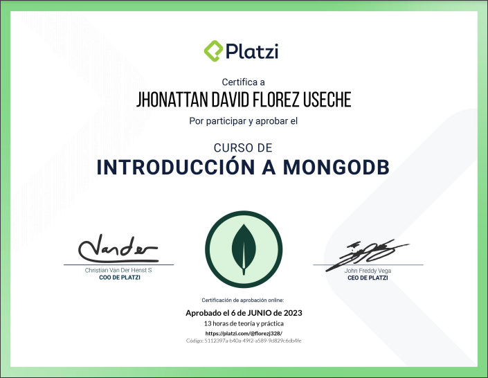

# Formacion-Practicante 

<strong style="font-size: 20px;">Certificado Profesional de Git y GitHub</strong>

<strong style="font-size: 20px;">Certificado Introducción a la Terminal y Línea de Comandos</strong>

<strong style="font-size: 20px;">Certificado Programación Básica</strong>

---

<strong style="font-size: 20px;">Certificado Fundamentos de Bases de Datos</strong>

<strong style="font-size: 20px;">Certificado Práctico de SQL y MySQL</strong>

<strong style="font-size: 20px;">Certificado Práctico de SQL</strong>

---

<strong style="font-size: 20px;">Certificado Introducción a MongoDB</strong>

<strong style="font-size: 20px;">Certificado Modelado de Datos en MongoDB</strong>

---

<strong style="font-size: 20px;">Certificado Algoritmos y Diagramas de Flujo</strong>

<strong style="font-size: 20px;">Certificado Manejo de Datos, Estructuras y Funciones</strong>

<strong style="font-size: 20px;">Certificado Lenguajes de Programación</strong>

---

<strong style="font-size: 20px;">Certificado Excel para Principiantes</strong>

<strong style="font-size: 20px;">Certificado Excel Básico</strong>

<strong style="font-size: 20px;">Certificado Excel Intermedio</strong>

---

<strong style="font-size: 20px;">Certificado Visualización De Datos</strong>

